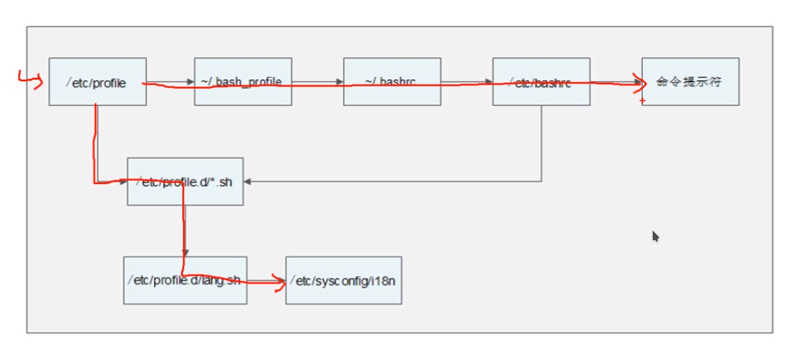

## shell 变量
变量叠加
```shell
x=123
x="$x"456
x=${x}789
# 最后x的值为"123456789"
```

```shell
set # 查看当前所有变量
set -u # 设定此选项，调用未声明变量时会报错(默认没有提示)
unset x # 删除变量名

env # 查看环境变量
```

设置环境变量
```shell
export x=1 #
y=1
export y # 
```

`$PS1`提示符变量
* \d: 显示日期，格式为"星期 月 日"
* \H: 显示完整主机名
* \t: 显示24小时制时间，格式为"HH:MM:SS"
* \A: 显示24小时制时间，格式为"HH:MM"
* \u: 显示显示当前用户名
* \w: 显示显示当前所在目录的完整名称
* \W: 显示当前所在目录的最后一个目录
* \$: 显示提示符，如果是root用户会显示提示符为"#"，如果是普通用户会显示提示符为"$"

`$PS2`换行后的提示符变量

`locale` # 查询当前语系
* `-a`: 查看支持的所有语系
* LANG: 定义系统主语系的变量
* LC_ALL: 定义整体语系的变量

位置参数变量

|位置参数变量| 作用 |
|:----------:|:----:|
|     $n     |n为数字，$0代表命令本身，$1-$9代表第一到第九个参数，十个以上的参数需要用大括号包含，如${10}|
|     $*     |这个变量代表命令行中所有的参数，$*把所有的参数看成一个整体|
|     $@     |同上，不过$@把每个参数区分对待|
|     $#     |这个变量代表命令行中所有参数的个数|


与定义变量

|与定义变量|作用|
|:--------:|----|
|    $?    |最后一次执行的命令的返回状态。如果这个变量的值为0，证明上一个命令正确执行；如果这个变量的值为非0(具体是哪个数，由命令自己来决定)，则证明上一个命令执行不正确了。|
|    $$    |当前进程的进程号(PID)|
|    $!    |后台运行的最后一个进程的进程号(PID)|

样例脚本:
```shell
#!/bin/bash

for i in 1 2 3 4
do
    echo $i
done

for i in "$*"
do
    echo $i
done

for i in "$@"
do
    echo $i
done
```

接收键盘输入  
`read` 选项 变量名
* 选项:
* `-p` "提示信息": 在等待read输入时，输出提示信息
* `-t` 秒数: read 命令会一直等待用户输入，使用此选项可以指定等待时间
* `-n` 字符数: read 命令只接受指定的字符数，就会执行
* `-s`: 隐藏输入的数据，使用与机密信息的输入

样例脚本:
```shell
#!/bin/bash

read -p "please input your name: " -t 30 name
echo $name

read -p "please input you password: " -s password
echo -e "\n"
echo $password

read -p "please input your sex [M/F]: " -n 1 sex
echo -e "\n"
echo $sex
```

## shell 运算符

`declare` 声明变量类型  
`declare [+/-]选项 变量名`
* `-`: 给变量设定类型属性
* `+`: 取消变量类型属性
* `-a`: 将变量声明数组型
* `-i`: 将变量声明为整数型
* `-x`: 将变量声明为环境变量(与`export`的作用相似，但其实`export`就是`declare`命令的作用)
* `-r`: 将变量声明为只读变量(只读属性会让变量不能修改不能删除，甚至不能取消只读属性)
* `-p`: 显示指定变量的被声明的类型(后面不跟变量名则显示所有的变量的属性)
```shell
aa=11
bb=22
# 数值计算方法1
declare -i cc=$aa+$bb
# 数值计算方法2
dd=$(expr $aa + $bb) # 加号两侧必须有空格
# 数值计算方法3
ee=$(($aa+$bb)) # 可以有空格，也可以不加
ff=$[$aa+$bb] # 可以有空格


# 定义数组
moive[0]=zp
movie[1]=tp
declare -a movie[2]=live
# 查看数组
echo ${movie}
echo ${movie[2]}
echo ${movie[*]}
```

变量测试  

|变量置换方式|变量y没有设置|变量y为空|变量y设置值|
|:----------:|:-----------:|:-------:|:---------:|
|x=${y-新值} |x=新值       |x为空    |x=$y       |
|x=${y:-新值}|x=新值       |x=新值   |x=$y       |
|x=${y+新值} |x为空        |x=新值   |x=新值     |
|x=${y:+新值}|x为空        |x为空    |x=新值     |
|x=${y=新值} |x=新值，y=新值|x为空，y不变|x=$y，y不变|
|x=${y:=新值}|x=新值，y=新值|x=新值，y=新值|x=$y，y不变|
|x=${y?新值} |新值输出到标准错误输出(就是屏幕)|x为空|x=$y|
|x=${y:?新值}|新值输出到标准错误输出|新值新值输出到标准错误输出|x=$y|

## 环境变量配置文件

`source 配置文件值` 或  `. 配置文件值` 

### 简介

```shell
/etc/profile # 历史命令条数
/etc/profile.d/*.sh
~/.bashrc # 别名
~/.bash_profile
/etc/bashrc # 修改命令提示符
```
环境变量加载路径，正常输入用户名密码时:  

从su用户切换到当前用户时：

**图片中的`/etc/sysconfig/i18n`是原先的语系配置文件，现在是语系的配置文件是`/etc/locale.conf`**

### 功能

`/etc/profile`的作用:
* USER变量
* LONGAME变量
* MAIL变量
* PATH变量
* HOSTNAME变量
* HISTSIZE变量
* umask变量
* 调用`/etc/profile.d/*.sh`文件

### 其他配置文件

本地终端登录信息: `/etc/issue`

|转义符|作用                            |
|:----:|--------------------------------|
|  \d  |显示当前系统日期                |
|  \s  |显示操作系统名称                |
|  \l  |显示登录的终端号，这个比较常用  |
|  \m  |显示硬件体系结构，如i386、i686等|
|  \n  |显示主机名                      |
|  \o  |显示域名                        |
|  \r  |显示内核版本                    |
|  \t  |显示当前系统时间                |
|  \u  |显示当前登录用户的序列号        |

远程终端欢迎信息: `/etc/issue.net`
* 转义符在`/etc/issue.net`文件中不能使用
* 是否显示此欢迎信息，由ssh的配置文件`/etc/ssh/sshd_config`决定，加入`Banner /etc/issue.net`行才能显示(记得重启SSH服务)

登录后欢迎信息: `/etc/motd`
* 不管是本地登录，还是远程登录，都可以提示此欢迎信息

## shell 正则表达式

### 正则表达式

主要用于字符串的模式分割、匹配、查找及替换操作。

基础正则表达式

|元字符 |作用|
|:-----:|----|
|   *   |前一个字符匹配0次或任意多次|
|   .   |匹配除了换行符外任意一个字符|
|   ^   |匹配行首，例如:^hello会匹配以hello开头的行|
|   $   |匹配行尾，例如:hello&会匹配以hello结尾的行|
| \[\]  |匹配中括号中指定的任意一个字符，只匹配一个字符，例如:\[aeiou\]匹配任意一个元音字符，\[0-9\]匹配任意数字，\[a-z\]\[0-9\]匹配任意小写字母和一位数字|
| \[^\] |匹配除中括号的字符以外的任意一个字符。例如:\[^0-9\]匹配任意一位非数字字符|
|  \\   |转义符。用于取消特殊符号的含义|
|\{n\}  |表示其前面的字符恰好出现n次|
|\{n,\} |表示其前面的字符出现不小于n次。例如:\[0-9\]\{4\}匹配4位数字|
|\{n,m\}|表示前面的字符至少出现n次，最多出现m次。例如\[a-z\]\{6,8\}匹配6到8位的小写字母。|

扩展正则 `?`, `()`

### 字符截取命令
